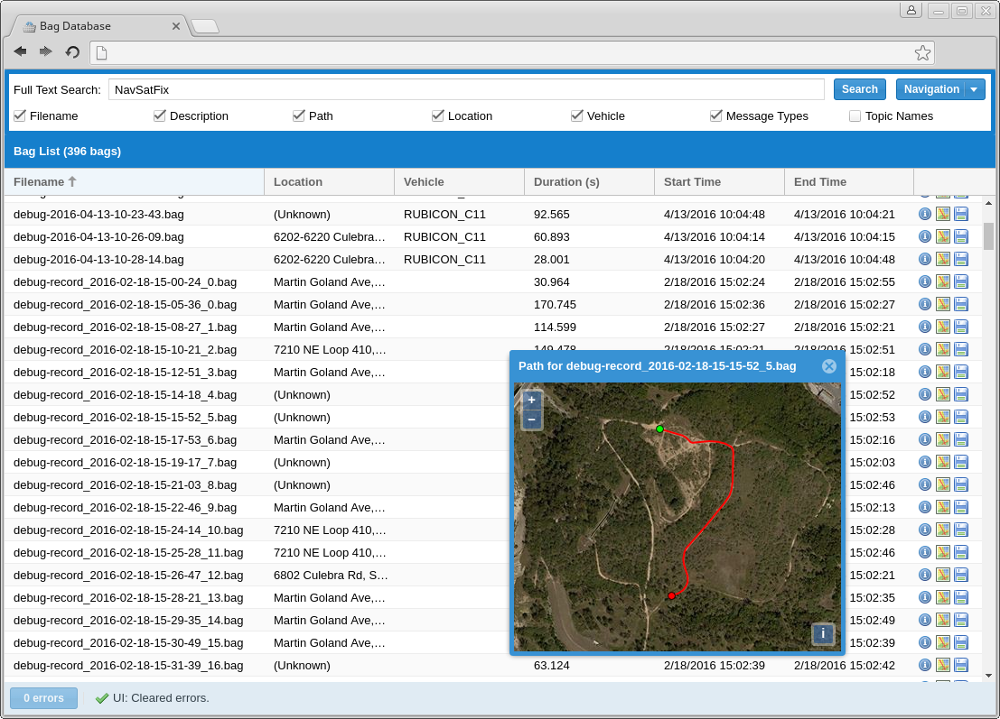

# Bag Database   [](https://travis-ci.org/swri-robotics/bag-database)

The Bag Database is a web-based application that monitors a directory for ROS bag 
files, parses their metadata, and provides a friendly web interface for searching 
for bags and downloading them.  Its goal is to make it easy to catalog thousands
of bag files, search through them for relevant data such as topic names and message
types, view information about them, and download them.

Currently it is intended primarily for internal use.  Any user can edit metadata
for bag files, and it is expected that users have access to the location where bags
are stored and will be manually uploading files there.



## Features

- **Directory Monitoring**: It will watch a directory for any changes and
  automatically scan any bag files placed in that directory.
- **Full-text Searching**: The Search field will search the text fields selected by the user in every
  bag file for any strings containing the provided text; it can search:
  - The bag's file name
  - The path leading to the bag on the filesystem
  - A user-provided description of the bag
  - The name of the physical location where the bag was recorded
    - (Either this must be manually entered or support for Google's reverse 
      geocoding API must be enabled)
  - The name of the vehicle
  - The types of any messages used
  - The topics published
- **Filtering**: Every column in the grid can by filtered by arbitrary values;
  click the down arrow on a column header to set a filter.
- **Folder View**: Instead of a flat list of every bag file in the database, you
  can also see them in a hierarchical view mirroring their layout on the
  filesystem which indicates how many bags are under every path and can be
  filtered by filename.
- **Displaying Metadata**: All of the same information you could obtain with 
  `rosbag info` is extracted and stored so that it can be easily viewed for any
  bag file.
- **Message Types and Topics**: You can also easily view all of the different 
  message types and topics used in the bag file.
- **Displaying GPS Coordinates**: GPS coordinates recorded in a bag file are
  extracted and stored, and you can view the path of the coordinates using
  either Bing Maps or an arbitrary WMTS tile map server.
- **Downloading**: Every bag file can be downloaded from the interface without
  needing to find it on the host filesystem.  Links to bag files can also be
  obtained by right-clicking on them.
- **Viewing Images**: You can view the first image on any sensor_msgs/Image or
  sensor_msgs/CompressedImage topic by clicking on an icon next to the topic
  in the bag details window.
- **Viewing Image Streams**: You can view any sensor_msgs/Image or
  sensor_msgs/CompressedImage topic as an embedded video stream by clicking
  on an icon next to the topic in the bag details window.
- **Tagging**: Bags can be tagged and searched for with arbitrary metadata 
  strings.  Existing tags on arbitrary metadata topics in bag files will be
  automatically read.
- **LDAP Login**: If enabled, the bag database will authenticate users against
  an LDAP database before allowing access.  LDAP configuration details can
  be provided by customizing environment variables when starting it as a
  Docker container.  
  The Admin user is still handled separately and can log in directly by
  visiting the URL `/signin` or by loggin in as a normal user and then using
  the Navigation menu.

  
  

## Compiling

The bag database is a Spring-based web application that requires Java 8.0 or later.
To compile it, you need JDK 8.0 or later and Maven 3.0.5 or later.  To build a
WAR package, run:

`mvn package`

The preferred mechanism for running the bag database is as a 
[Docker](https://www.docker.com/) container.  To build the docker image, run:

```bash
cd src/main/docker
sudo docker build . -t bag-database:latest
```

## Upgrading

If you're using Docker, upgrading to the latest version is as easy as pulling 
the latest image and re-creating the container.  Just run 
`docker pull swrirobotics/bag-database:latest`, stop the old container, and set
up a new one as described below.  Make sure you check the list of environment
variables to see what's been changed or added.

## Running

### Docker (Preferred method)

The bag database can run standalone in order to demonstrate its functionality, but
if you do so it will have to rebuild the database every time it restarts.  Instead
you should link it to an external database.  PostgreSQL with PostGIS extensions is
the only supported database.

The instructions here will describe how to manually create Docker containers, but
you may find it easier to use [Docker Compose](https://docs.docker.com/compose/) to
run the included `docker-compose.yml` file instead; just customize it to your needs.

First, create a virtual network for the containers:
```bash
docker network create bagdb
```

Start a PostgreSQL container with PostGIS support:
```
docker run -d \
    --name bagdb-postgres \
    --net bagdb \
    -v /var/lib/bagdb-postgres:/var/lib/postgresql/data \
    -e POSTGRES_PASSWORD=letmein \
    -e POSTGRES_USER=bag_database \
    -e POSTGRES_DB=bag_database \
    mdillon/postgis:latest
```

The bag database exposes port 8080 and expects to find bag files in a volume at /bags by default.  You can run it like so:
```
docker run -d \
    -p 8080:8080 \
    -v /bag/location:/bags \
    --name bagdb \
    --net bagdb \
    -e DB_DRIVER=org.postgresql.Driver \
    -e DB_PASS=letmein \
    -e DB_URL="jdbc:postgresql://bagdb-postgres/bag_database" \
    -e DB_USER=bag_database \
    -e METADATA_TOPICS="/metadata" \
    -e VEHICLE_NAME_TOPICS="/vehicle_name" \
    -e GPS_TOPICS="/localization/gps, /gps, /imu/fix" \
    swrirobotics/bag-database:latest
```

After the bag database has successfully started, the bag database should be available at `http://127.0.0.1:8080`.  Modify your Docker parameters as desired to expose it on a different port or set up [HAProxy](https://hub.docker.com/_/haproxy/) if you want to enable SSL or have it accessible via a subdirectory.

#### Volumes

Several volumes within the Docker container may be useful to mount externally:

##### `/bags`

The location which will be monitored for bag files.

##### `/usr/local/tomcat/logs`

The location where Tomcat places its log files.

#### Environment Variables

Several environment variables can be set to configure the Docker container:

##### ADMIN_PASSWORD

The default password for administrative access.  If this is not set, one will be randomly generated and printed to the log file on initial startup.

##### DB_DRIVER

The class name of the JDBC driver to use.

##### DB_PASS

The password to use when connecting to the database.

##### DB_URL

The JDBC URL for connecting to the database.

##### DB_USER

The username to use when connecting to the database.

##### GOOGLE_API_KEY

A Google API key that has permission to use the Google Maps GeoCoding API; this is necessary in order to resolve place names for GPS coordinates.

##### METADATA_TOPICS

A comma-separated list of `std_msgs/String` topics in bag files that will be searched for metadata.  The messages on the topic should be newline-separated tags that are made of colon-separated key/value pairs; for example:
```
name: John Doe
email: jdoe@example.com
```
Every value will be read from every topic specified, but if there are any duplicate keys, the last-read values will take precedence.

##### USE_TILE_MAP

Set this to `true` to use a WMTS tile map for displaying map imagery; set it to `false` to disable MapQuest.  The default is `true`.

##### TILE_MAP_URL

If `USE_TILE_MAP` is `true`, this URL will be used as a template for retrieving 
map tiles.  See the documentation for the `url` property of OpenLayers' 
[ol.source.XYZ](http://openlayers.org/en/latest/apidoc/ol.source.XYZ.html) class.  
The default value is `http://{a-d}.tile.stamen.com/terrain/{z}/{x}/{y}.jpg`, which will
use the terrain map provided by [Stamen](http://maps.stamen.com/).

##### TILE_WIDTH_PX

The width of the tiles returned from the tile map in pixels.  The default is `256`.

##### TILE_HEIGHT_PX

The height of the tiles returned from the tile map in pixels.  The default is `256`.

##### USE_BING

Set this to `true` to use Bing Maps for displaying map imagery; set it to `false` to disable Bing.  The default is `false`.

##### BING_KEY

The API key to use when connecting to Bing Maps.

##### VEHICLE_NAME_TOPICS

A comma-separated list of `std_msg/String` topics that will be searched for a vehicle name; the first one found will be used.

##### GPS_TOPICS

A comma-separated list of topics to search for GPS messages; the first one found will be used.  Any message that has the following fields will work:
```
float64 latitude
float64 longitude
Header header
```
If there are no topics configured or none of them are found, it will try to use the first topic it can find that publishes the `sensor_msgs/NavSatFix`, `gps_common/GPSFix`, or `marti_gps_common/GPSFix` messages, in that order.

##### LDAP_BINDDN

If authenticating against an LDAP server that requires authentication, the Bind DN.  If this is left blank, it will not attempt to authenticate.

##### LDAP_BIND_PASSWORD

If authenticating against an LDAP server that requires authentication, the password for the Bind DN.

##### LDAP_SEARCH_BASE

The search base for finding users in the LDAP server.

##### LDAP_SERVER

The LDAP server for authentication.  If set to an empty string, LDAP authentication will not be enabled, and anonymous users may connect.

##### LDAP_USER_PATTERN

The pattern for finding user DNs in the LDAP server.  `{0}` will be replaced with the username from the login form.

##### DEBUG_JAVASCRIPT

Set this to `true` to force the application to load non-minified versions of Javascript files.  This will increase load times.  The default is `false`.

### As An Application Server Servlet

Only Tomcat 8.0 with Java 8.0 has been tested.

1. Start up a PostgreSQL server; create an empty database and a user with access to it.
2. Start up your application server and deploy the WAR file to it.
3. The bag database will automatically create a directory at `${HOME}/.ros-bag-database` and place its configuration inside there.
4. Edit `${HOME}/.ros-bag-database/settings.yml` and set your configuration, then restart the application.  Here's an example of a valid config file; keys you don't want to set can be omitted.

    ```yml
    !com.github.swrirobotics.support.web.Configuration
    bingKey: PKnOQDvUxRJ0bEZdBH7m
    driver: org.postgresql.Driver
    googleApiKey: PKnOQDvUxRJ0bEZdBH7m
    gpsTopics: 
    - /localization/gps
    - /gps
    - /vehicle/gps/fix
    jdbcPassword: letmein
    jdbcUrl: jdbc:postgresql://bagdb-postgres/bag_database
    jdbcUsername: bag_database
    useBing: true
    useMapQuest: false
    vehicleNameTopics: 
    - /vms/vehicle_name
    ```

5. Look inside the log file at `${TOMCAT_HOME}/logs/bag_database.log` to find the automatically-generated administrator password.
6. Log in through the GUI and use the Maintenance panel to change the password.
7. Note that in order for video streaming to work, `ffmpeg` version 3 or higher must be available on the system path.


#### Set up a Standalone LDAP Server

All these steps are inspired from this [blog](https://www.linux.com/topic/desktop/how-install-openldap-ubuntu-server-1804/).

1. Installation:
    ```
    sudo apt-get update
    sudo apt-get upgrade -y
    sudo apt-get install slapd ldap-utils -y
    ```

   During the setup, it will ask you to provide an Administrator password.

2. Configuration:
    ```
   sudo dpkg-reconfigure slapd
    ```

   It will ask you several questions for configuring SLAPD; these example values have been tested.

   - Omit: No (Keeps default configuration of the ldap server)
   - DNS domain name: example.com
   - Organisation name: Example Organization
   - Admin password: pwd (Keep same as the earlier one and confirm the same)
   - Database Type: MDB
   - Purging Database: Yes
   - Move old Database: Yes

3. There is an example file in this repository named `OpenLDAP_data.ldif` that will
   create a few organizational units in your LDAP database and then add a few users.
   You should customize this to suit your organization. The base structure of the
   file is also adapted from the [blog](https://www.linux.com/topic/desktop/how-install-openldap-ubuntu-server-1804/).
    ``` 
    ldapadd -x -D cn=admin,dc=example,dc=com -W -f OpenLDAP_data.ldif
    ```

   You will be asked for the `admin` password here.

4. The OpenLDAP server should be running by now, you can check the status with the
    following command:
    ```
    sudo systemctl status slapd
    ```

    If you need to manually restart or enable it use the following commands:
    ```
    sudo systemctl enable slapd
    sudo systemctl restart slapd
    ```

5. In case you need to remove OpenLDAP use the following commands taken from this [blog](https://installlion.com/ubuntu/xenial/main/s/slapd/uninstall/index.html):
    ```
    sudo apt-get remove --auto-remove slapd  
    ```

    And to completely purge remove:
    ```
    sudo apt-get purge --auto-remove slapd
    ```

6. Now you can launch the Bag Database.  If you used the example LDIF file to load users,
   you can log in with these credentials:
    - username: ben, password: benspassword
    - username: bob, password: bobspassword
