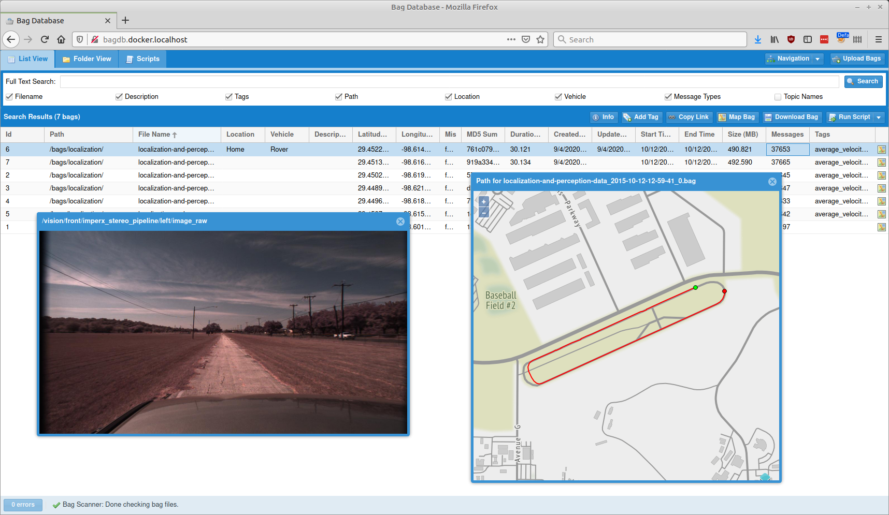

# The Bag Database
   

The Bag Database is a web-based application that monitors a directory for ROS bag 
files, parses their metadata, and provides a friendly web interface for searching 
for bags, downloading them, and doing post-processing on them.

## Features

- **[List View](web-interface/list-view)**: View all of your bags in a grid that
  can be sorted, filtered, and searched based on a variety of fields.
- **[Folder View](web-interface/folder-view.md)**: If you use a directory
  hierarchy on disk to sort your bags, you can view it that way, instead, and see
  a quick summary of how many bags are in each folder.
- **[Scripting](web-interface/scripts)**: Upload scripts for doing post-processing
  on your bag files in isolated Docker containers, then tag bags with the results.
- **[REST API](rest-api/)**: If you want to query data from or submit it to the
  bag database through an automated process, there's a convenient API for that, too.
- **Web-Based Bag Inspection**: The interface has a variety of tools for inspecting
  your bag files to help you find the data you need, including:
  - [Bag Details](web-interface/bag-details): Quickly view all of a bag's metadata,
  including all of the topics and message types used in it.
    - Also view an image from image topics, or render the whole topic as a video!
  - [Map View](web-interface/list-view#map-bag): Display all of a bag's (or a series
  of bags') GPS coordinates on an interactive map so you can see where your vehicle
  went.
  - [Open With External Apps](web-interface/open-with): Bag files can be streamed to external
  web applications such as [Webviz](https://webviz.io/) for more complex visualizations.
- **[Authentication](configuration/ldap)**: If you don't want everybody on your
  network to have open access to your database, the Bag Database can be connected
  to an LDAP server for authenticating users.
