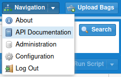

# REST API

The Bag Database's REST API is automatically generated as part of its build process
and served together with the web application.  Go to the `API Documentation` item in the
`Navigation` menu in your Bag Database installation to view it.

