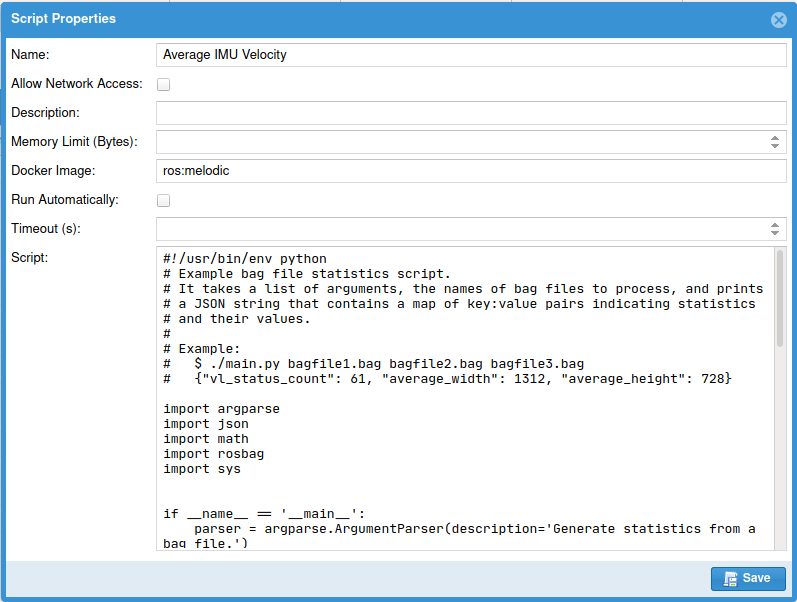

# Scripts

One of the Bag Database's most powerful features is the ability to enter arbitrary scripts
that can then be run in isolated Docker containers to perform post-processing on bag files.
Scripts can be run manually or automatically when new bag files are added.
In addition to generating statistics that will be stored in the database, these scripts can also
set tags on or update the metadata for bag files to make it easier to find interesting bags.

Consult the [Scripts](../web-interface/scripts) Web Interface documentation for details about
the UI.

## Script Fields

Exactly what makes a script?

### Name

A friendly name for the script.  This will show up in the Script Results panel to make it easy
to identify which script generated which results.

### Allow Network Access

If this is checked, the Docker container the script runs inside will be allowed to access the
network.  For security purposes, by default this is not allowed.

### Description

A longer description of a script to make it easier for you to keep track of them.

### Docker Image

The name of the Docker image that the script will run inside.  This image needs to contain
all of your script's pre-requisites installed.  `ros:melodic` is a convenient one for analyzing
ROS bags, but you could make your own image with additional programs and use it instead.

Images in local registries can also be used; just refer to them by their full label name,
for example, `myexample.com:5000/ros:melodic`.  Unfortunately, the Docker API library in use
does not currently support registries that require authentication.

### Memory Limit (Bytes)

The maximum amount of memory the script's container may use.  If it is blank or zero, there
is no limit.

### Timeout (s)

The maximum amount of time the script's container may run before it is killed.  If this is unset
or zero, it may run forever.

### Run Automatically

If this is checked, this script will automatically run on every new bag file added to the database.

Automatic scripts are run individually on every added bag file.  If you want to run a script on a batch of
bags after adding several new ones at once, instead use the [REST API](../rest-api) after 
finishing uploading your bags to run the desired script.

### Run Criteria

If Run Automatically is checked, criteria can be set to control which bags will be processed.
Every row in this table is a set of criteria.  If any set of criteria matches,
the script will run.  Within a set of criteria, all of its conditions must match;
empty fields are ignored.

#### Criteria Fields

| Name | Description | Examples |
| ---- | ----------- | -------- |
| Directory | A [Java regular expression](https://docs.oracle.com/en/java/javase/11/docs/api/java.base/java/util/regex/Pattern.html) that the directory containing the bag must match | `^/bags/project/.*$` |
| Filename | A [Java regular expression](https://docs.oracle.com/en/java/javase/11/docs/api/java.base/java/util/regex/Pattern.html) that the bag's filename must match | `^.*vehicle-.*\.bag$` |
| Message Types | A comma-separated list of ROS message types, all of which must be in the bag file | `gps_common/GPSFix, sensor_msgs/Imu` |
| Topic Names | A comma-separated list of ROS topics, all of which must be in the bag file | `/localization/imu, /camera/right` |

### Script

The actual text content of your script.  This text area's editing functionality is very limited;
it's easiest to write your script in a proper IDE and then copy/paste it into here.

If you're storing your scripts in a source repository, you might even consider setting up a
continuous integration script to automatically push your script to the bag database when you
commit a new version.
