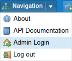
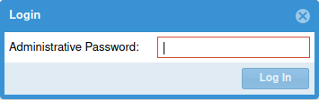
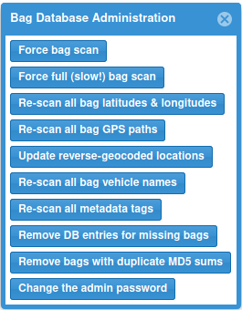
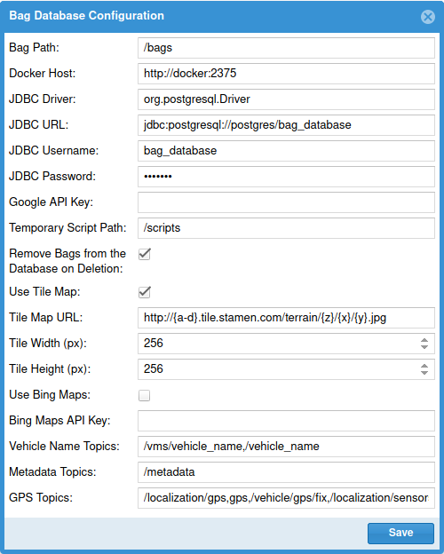

# Administration

A user account that has the `ROLE_ADMIN` role can use the Navigation menu to open the
Administration and Configuration panel.

Clicking on that options will present you with a window requesting an admin password.
This may be have been set through an environment variable when starting your Docker container,
or, if none was set, one will be randomly generated and printed in the log file when the
Bag Database is starting up.

Enter that password here to log in, and then you will have access to the administration panels.

## Bag Database Administration

Each of these buttons can be used to force the bag database to perform certain actions.
These are normally only necessary if something in the database has been corrupted and needs
to be overwritten.

### Force bag scan

Searches through all of the files in the bag path to find new bags.

### Force full (slow!) bag scan

Searches through all of the files in the bag path, but also forces the Bag Database to
re-process all existing bags.  This can take a very long time if you have a lot of bags.

### Re-scan all bag latitudes & longitudes

Finds the first GPS coordinate in every bag file and updates its latitude & longitude
in the database with that value.

### Re-scan all bag GPS paths

Reads every GPS coordinate from every bag file and updates their paths in the database.  Bags
that previous had GPS coordinates successfully extracted will not be re-processed.

### Update reverse-geocoded locations

If the reverse-geocoding service is enabled, attempts to find the location name for every
bag file and update it in the database.

### Re-scan all bag vehicle names

Checks all bag files' vehicle name topics and updates their vehicle name in the database.

### Re-scan all metadata tags

Checks all metadata topics in all bag files and updates their tags in the database.

### Remove DB entries for missing bags

If the Bag Database's configuration is set to not automatically remove missing bags, then
if a file is removed, it will not remove the entry for that file from the database.  This will
remove all of those orphaned entries.

### Remove bags with duplicate MD5 sums

If the database has multiple entries that have the same MD5 sum, this will remove all but
one of them.

### Change the admin password

Changes the admin password.

## Bag Database Configuration

This panel can be used to view or modify various configuration options for the Bag Database.
This is only useful for modifying the configuration if you are running the Bag Database
in a standalone Tomcat server; if you are running it using the Docker image, these values
will be overwritten every time the container starts based on its environment variables.

Detailed information about what each value does is available in [Docker](../installation/docker).