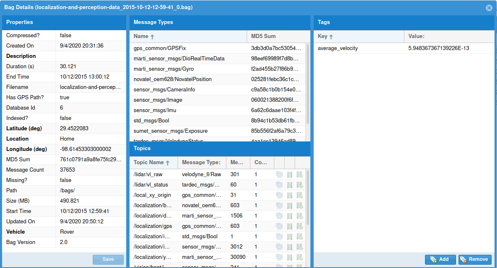

# Bag Details

This window displays detailed information about a bag.

## Properties

The properties are a list of information about a bag file.  Most of these fields were
statically determined by when reading the modified and cannot be modified, but **Bold** fields
are used to store dynamically determined information and can be modified.

## Message Types

All of the types of messages that were read from a bag file.  It also
displays the MD5 Sum of each message type, since messages with the same name could have
different types if the message definition changed.

## Topics

All of the topics in the bag file.  In addition to displaying a list of topics, the action
icons in the right can be used to view images and videos from topics that have a `sensor_msgs/Image`
or `sensor_msgs/CompressedImage` type.

The Bag Database will do its best to use OpenCV to convert images into a format that can
be rendered into a bag file, but OpenCV may not be able to parse some image formats.
Consult the server log if images do not render as expected.

## Tags

If a bag has had tags set on it, they will all be displayed here.  This panel can also be
used to add or remove tags.