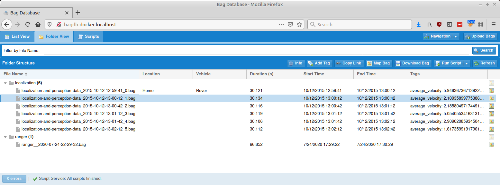

# Folder View

The folder view panel is similar to the [List View](list-view), but
it displays all of the bag files in a hierarchical view based on the underlying
directory structure on disk.

## Filter by File Name

The Folder View's filtering capabilities are not nearly as advanced as the List View;
it is only capable of filtering bags based on their file name.

## Actions

The Folder View is capable of the same set of actions as the List View; see its documentation.