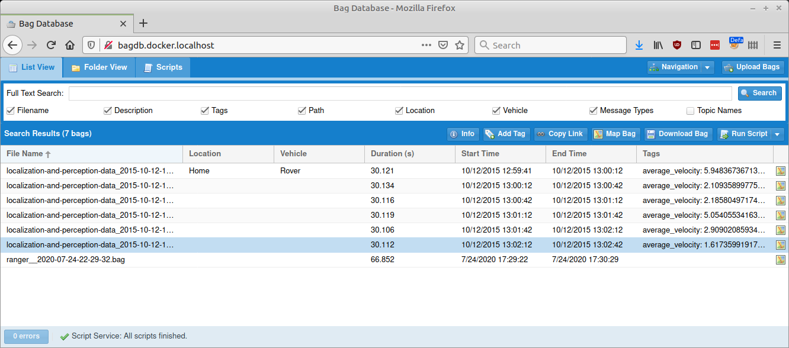
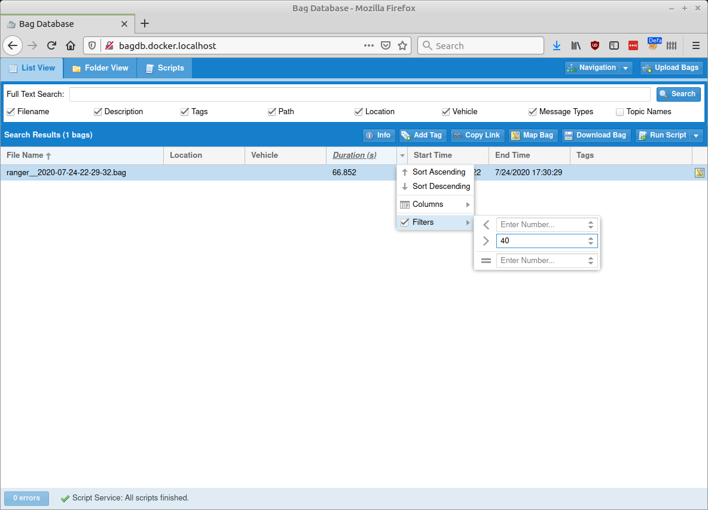
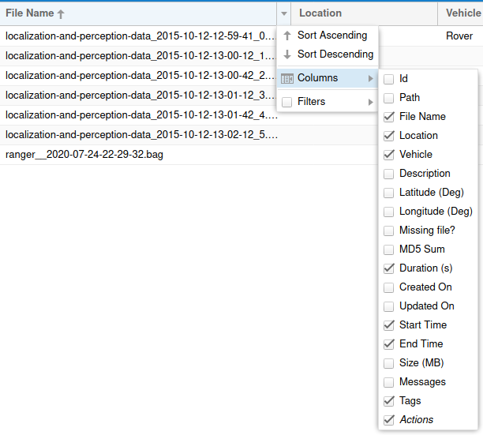
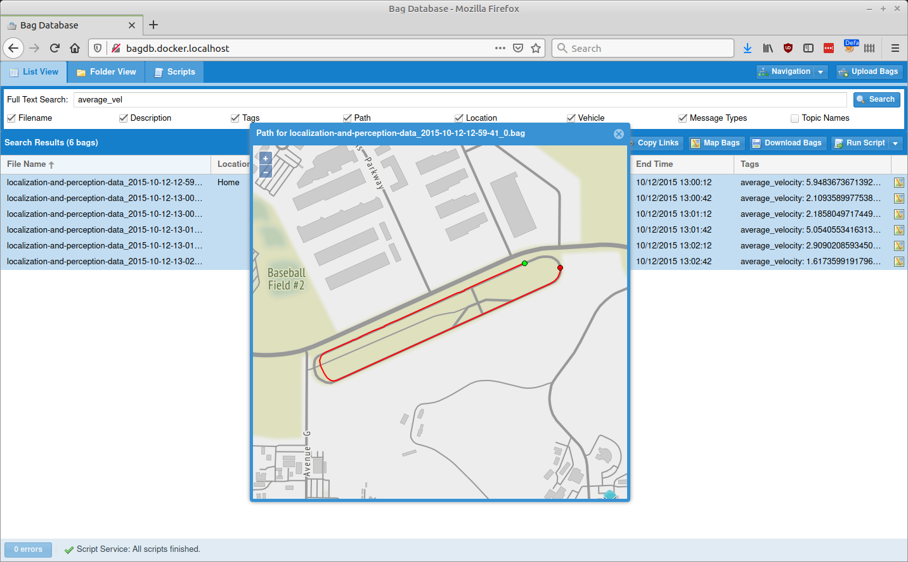

# List View

The primary interface for the Bag Database is a grid that lists all of the bags.  It can filter
all of the bags by various criteria, view details about their contents, and perform various
actions on them.

## Searching & Filtering

### Full Text Search

If text is entered in the text field at the top, clicking the "Search" button will filter
the grid so that it only lists bags which contain that text in any of the checked fields.

### Filtering

For more detailed filtering, it is possible to set filters on individual columns.

Hovering over a column's headerand clicking on the arrow on its right side will display a sub-menu
that can be used to set a filter on that column; only bags that match all of the filters will
be displayed.

### Visible Columns

Note that not all columns are visible by default; columns can also be hidden and shown
through the drop-down menu in the header row.

## Actions

Multiple actions can be performed either by selecting bag files are clicking buttons in the
Search Results title bar or by right-clicking on individual bags.

### Info

Displays a window with detailed information about the bag.  See [Bag Details](bag-details)

### Add Tag

Adds a tag with a value to a bag or set of bags; tags can be searched through the Full Text Search box.

### Copy Link

Copies links to the clipboard that can be used to download the selected bags.

### Map Bag

Displays a map that displays all of the selected bags' GPS coordinates as a single route.

Note that the map icon on the right side of each row acts as a quick link to display the
coordinates for only that bag, and it also serves to quickly indicate whether a bag has
any GPS coordinates at all; it will be grayed out if none are available. 

By default, the Bag Database uses map tiles provided by [Stamen](http://maps.stamen.com/), which
are freely available under the [CC BY 3.0](http://maps.stamen.com/) license.  Configuration options
as described in [Docker](../installation/docker) can be used to load tiles from a different WMTS tile
server or from Microsoft Bing.

### Download Bag

Downloads the bag file.

### Run Script

Runs a script on the selected bag file.  Refer to the [Scripts](scripts) section
of the Web Interface for details on the UI or the [Scripts](../scripts) top-level section for
information about how they work in general.

When a script runs, a window will appear that displays the Run UUID.  Every individual run
is assigned a unique ID that can be used to associate it with its results in the Script Results
panel later.