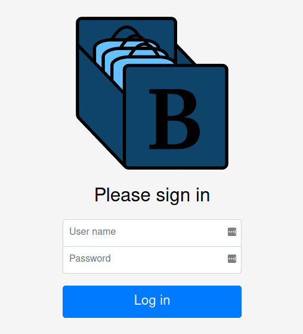

# Login

If you have not enabled authenticating against an LDAP server, users do not need to log in
to access the Bag Database.  It was originally designed with the expectation that it would be
running on a trusted internal network and everybody who can access it should be able to view
everything.

Despite that, there is still some potentially dangerous functionality that is locked behind
an administrative login.  Read [Administration](administration) for more information about that.

If LDAP authentication *is* enabled, then all users will be required to go through a login
page before they can access it.

In addition to logging in as a user with an LDAP account, it is still possible to log in using
the built-in administrator account by using the user name `admin` and the password that was either
pre-set or auto-generated.