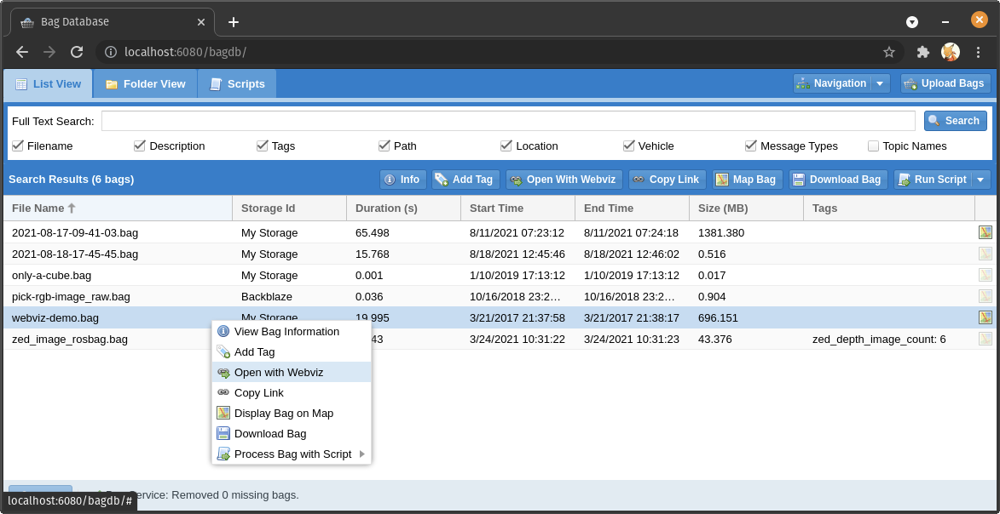
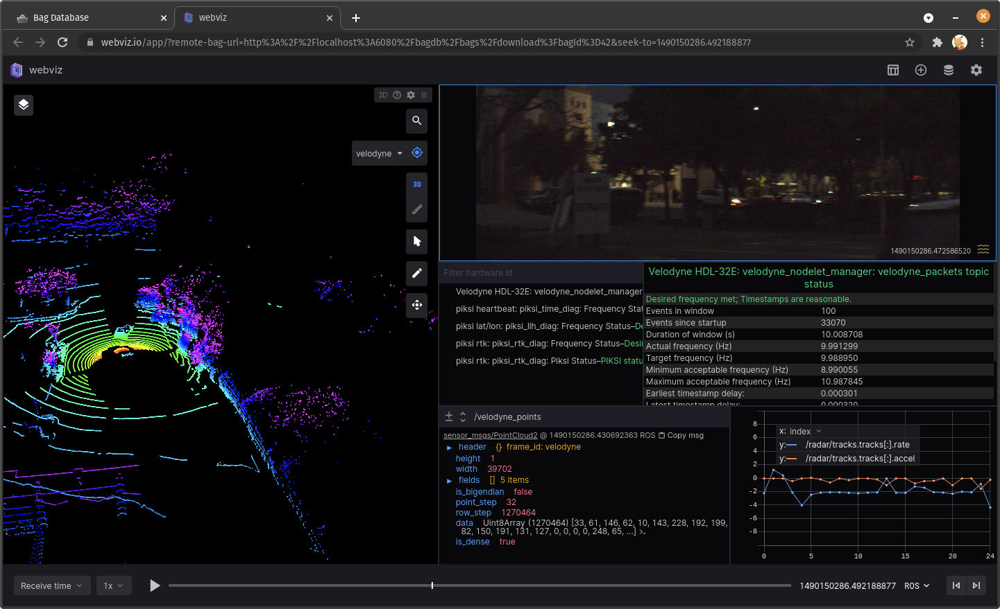

# Opening Bags with External Applications

The Bag Database's API call to download bag files supports CORS and HTTP Range requests, which
means web-based applications such as [Webviz](https://webviz.io/) can be easily integrated with it.
Just right-click on a bag file, click "Copy Link", and paste the URL in your application.

In addition, the Bag Database can be configured to display an "Open With..." menu for bag files to
quickly send them to external applications.

## Configuration

Bag Database will automatically provide [Webviz](https://webviz.io/app/) as an option by default.
You can customize this to change it or add your own web applications; see
the [Docker Installation instructions](../installation/docker/) for more information.