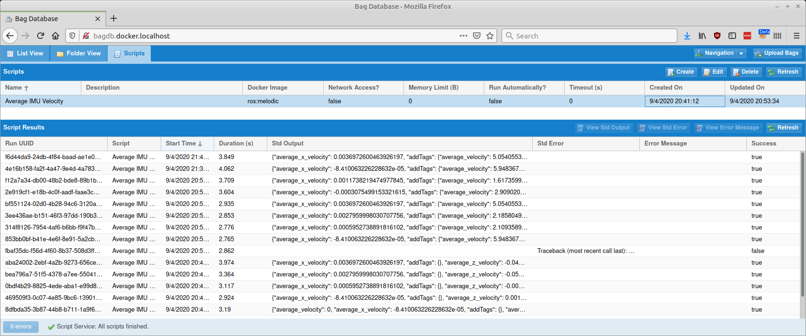

# Scripts

The scripts panel provides the ability to view & edit scripts that can do post-processing
on bag files, and it also displays the results of previous script runs.

For high-level details about how scripts work, see the top-level [Scripts](../scripts)
documentation.

## Scripts

Each row here represents a single script; buttons at the top of the panel can
modify them.

## Script Results

This table displays the results of every script that has been run.  Double-clicking on
a row will display the stdout from the script.  If a script printed to stderr or if there
was an error running a script, buttons at the top of the panel can be used to view that.