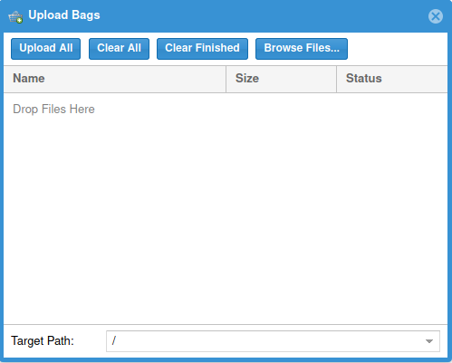

# Upload Bags

The button in the upper-right will open a window that can be used to upload new bag files.

The "Browse Files..." button can be used to select files to upload, or files can be dragged
and dropped on to the window from a file browser.

After files have been selected, clicking the "Upload All" button will upload them.  Be
patient and wait until it says they're done!  Uploading large files can take a while.

Note that bags can also be added to the database by writing them directly to the filesystem
where it stores bags; it will automatically detect and parse new files.  This can be more
convenient for automated systems.